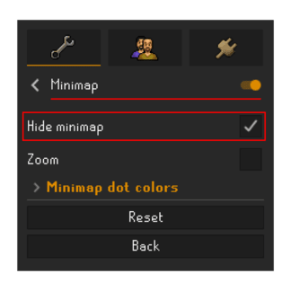

# jFlipper-OSRS

## Overview

This very simple Python script that automates flipping items in the OSRS Grand Exchange using the OSRS RuneLite client application along with the Flipping CoPilot RuneLite plugin. The script is designed to enhance efficiency by automating the buying and selling process of suggested copilot items to maximize hourly profits.

## Features

- **Automated Item Flipping**: Automatically handles the purchase and sale of items on the Grand Exchange based on parameters set in the Flipping CoPilot plugin. This ensures consistent profit generation without manual intervention.

- **Image and Color Recognition**: Utilizes powerful image recognition libraries (such as OpenCV) to interact with the RuneLite interface, accurately detecting and responding to in-game elements. Color detection is used to verify key actions, ensuring precise execution.

- **CPU Optimization**: The script is optimized to minimize CPU usage by taking screenshots only when necessary. This is particularly beneficial for users with less powerful computers, allowing the script to run efficiently without significant performance impact.

- **User-Friendly GUI**: Includes a simple and intuitive graphical user interface (GUI) built with `tkinter` and `customtkinter`. The GUI allows users to start the script with ease.

- **Customizable Settings**: Users can easily adjust various parameters within the GUI, such as sleep intervals and click delays, allowing for flexible and personalized automation settings.

## Possible Future Implementations

- **Automated Item Skipping**
- **Automated Login Sequence**
- **Discord Webhook Alerts**

## Requirements

- **OSRS RuneLite**: [Download RuneLite](https://runelite.net/)
- **Flipping CoPilot RuneLite Plugin**: Install via the RuneLite plugin hub.
- **Python 3.x**: [Download Python](https://www.python.org/)
- **Python Packages**:
  - `customtkinter`
  - `Pillow`
  - `pyautogui`
  - `pygetwindow`
  - `opencv-python`
  - `numpy`
  - `keyboard`

You can install the required packages using pip:

```bash
pip install -r requirements.txt
```

## How To Run:

### 1 .Setup RuneLite & the following plugins:

### Plugin Settings:

**Ensure the following plugin settings are selected/enabled.**

#### Menu Entry Swapper Plugin:


#### Stretched Mode & Minimap Plugin:

|  |  |
| :------------------------------------------------------: | :-----------------------------------------: |

#### Entity Hider & Display Settings Plugin:

|  |  |
| :--------------------------------------------------: | :----------------------------------------------------------: |

### 2. Enable Flipping CoPilot Plugin:

**Ensure the Flipping CoPilot plugin is **ALWAYS IN VIEW** on the screen when running the script. It is needed to detect when an abort offer suggested action is displayed on the screen from the Flipping CoPilot plugin and handle the cancel order accordingly.**

### 3. Grand Exchange Window & Ensure SETUP is CORRECT:

**Make sure the Grand Exchange window is **ALWAYS OPEN AND VISIBLE** while the script is running, Otherwise the script will exit as a result to reduce CPU usage**

**[IMPORTANT!] BEFORE you run the script ensure that there is nothing that could possible trigger a misclick in your view of the screen and the grand exchange, i.e other players, spells, teleports, pets, npcs etc.**

|  |  |
| :--------------------------------------------------: | :----------------------------------------------------: |

### Run the Script

1. Execute the CLI script from the command line:

   ```bash
   python jFlipper.py
   ```

   OR

2. Execute the GUI script from the command line:

   ```bash
   python gui.py
   ```

   OR

3. Run the script from the exe file located in the dist folder (Runs and instance of the GUI):

## Important Notes

- **Legal Disclaimer**: Use this script at your own risk! Automating actions in games violate the terms of service with RuneLite, Flipping CoPilot, and RuneScape, leading to account penalties and possible more severe consenquences.
- **Optimization**: Ensure your script is fine-tuned to avoid detection, such as using appropriate sleep intervals and randomizing actions.

## License

This project is licensed under the MIT License - see the [LICENSE](LICENSE) file for details.

## Acknowledgments

- **RuneLite** for their open-source application.
- The developers of the **Flipping CoPilot** plugin for their amazing contributions to the OSRS community.
